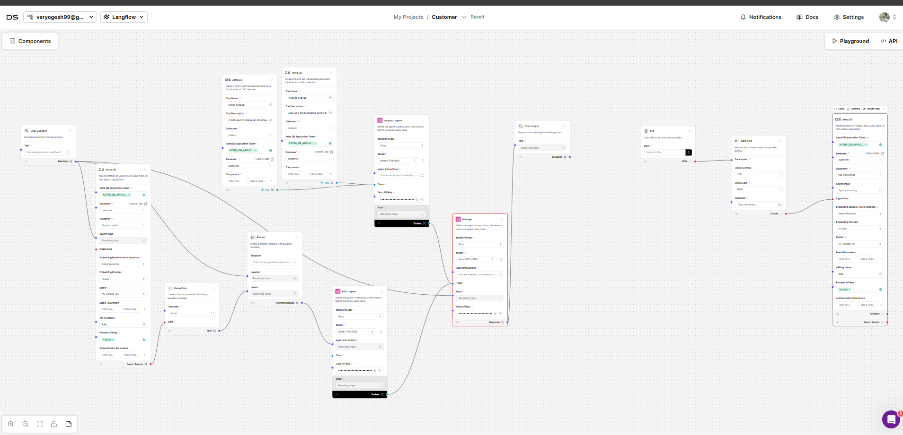

# Langflow Deployment and Visualization Guide

Simplified steps to upload, configure, and interact with your Langflow JSON on the DataStax Astra platform.

---

## Step 1: Upload Langflow JSON Configuration
1. Navigate to your **Astra DB workspace**.
2. Locate the **Vector Database** section.
3. Click on the **Flows** or **Graph Workspace** tab.
4. Select the option to **Import JSON Configuration** or **Upload Flow**.
5. Upload your `langflow_config.json` file.
6. Once uploaded, Astra will parse the configuration and display your flow details.

---

## Step 2: Set Up Environment Variables and API Tokens
1. **Generate an Application Token**:
   - Go to the **Settings** or **API Access** section in the Astra Dashboard.
   - Create a new token with permissions for Langflow access.
2. **Store the Token**:
   - Save the token in a `.env` file locally:
     ```plaintext
     APPLICATION_TOKEN=your_generated_token
     ```
3. **Update Python Script**:
   - Ensure your script loads environment variables (if not already configured).

---

## Step 3: Visualize the Langflow Graph

1. Go to the **Graph View** section after uploading the flow.
2. Visualize the Langflow configuration:
   - **Nodes**: Represent agents and components.
   - **Connections**: Show the flow of information.
3. Interact with the graph:
   - Click on nodes to view or edit properties.
   - Drag and rearrange nodes for better clarity.
   - Test the flow in real-time by simulating queries.

---

## Step 4: Play with the Langflow Graph
1. **Testing Interface**:
   - Send sample inputs to test different flow branches.
   - View detailed responses from each agent.
2. **Debug Issues**:
   - Check node logs for errors or misconfigurations.
   - Adjust properties or connections as needed.
3. **Iterate**:
   - Modify the flow and re-export the updated JSON if necessary.

---

This guide simplifies the process to help you get started quickly with Langflow on DataStax Astra!
